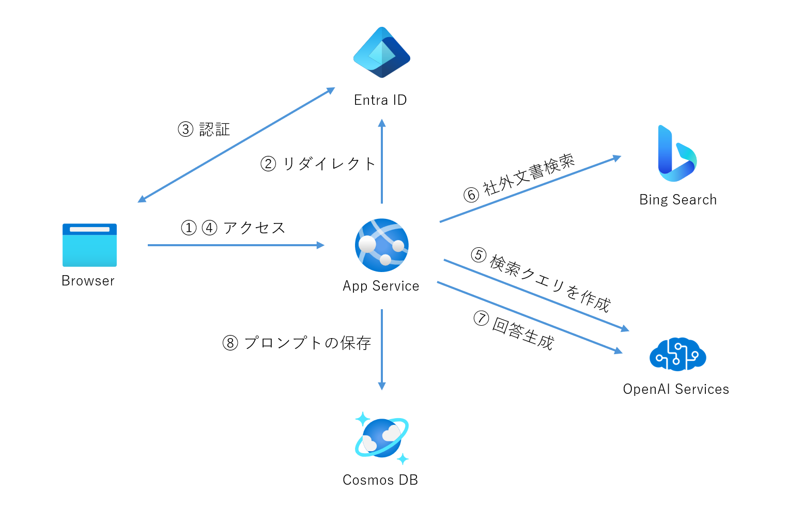
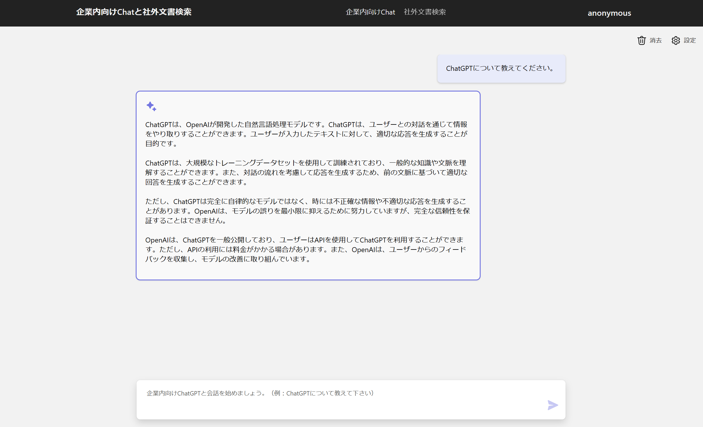
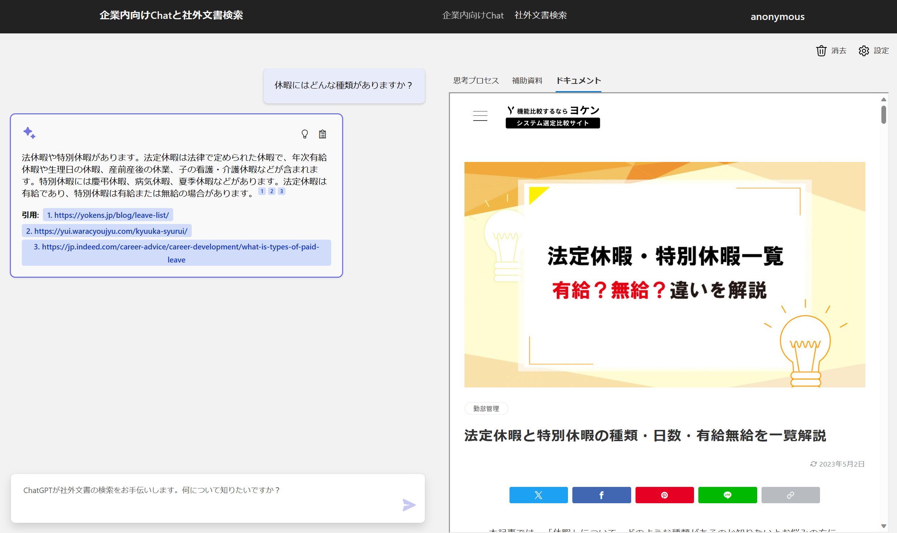
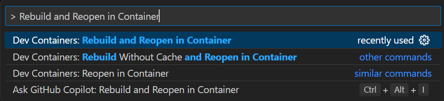

# Chat+社外文書検索

## 概要
このデモは、ChatGPT ライクなインターフェースを使用して社外文書を検索するアプリケーションの実装パターンであり、[Microsoft の社内文書リファレンスアーキテクチャ](https://github.com/Azure-Samples/jp-azureopenai-samples/tree/main/5.internal-document-search)をもとに社外文書検索用に変更したものになります。

デモアプリは以下のように動作します。

## Architecture


## 社内向け Chat UI


## 社外文書検索 UI



## セットアップガイド

> **重要:** このサンプルをデプロイするには、**Azure Open AI サービスが有効になっているサブスクリプションが必要です**。Azure Open AI サービスへのアクセス申請は[こちら](https://aka.ms/oaiapply)から行ってください。

### 開発コンテナの立ち上げ
Visual Studio Codeの拡張機能であるDev Containerを用います。
コマンドパレットを立ち上げ、Dockerを起動させた状態で、`Rebuild and Reopen in Container`と入力して実行してください。(コンテナの立ち上がりに約10分程時間がかかります。)



開発コンテナを立ち上げると、以下の開発環境がセットアップされます。
- [Azure Developer CLI](https://aka.ms/azure-dev/install) （version 1.0.2以降推奨）
- [Azure CLI](https://learn.microsoft.com/cli/azure/install-azure-cli) （version 2.50.0以降推奨）
- [Python 3+](https://www.python.org/downloads/)（version 3.11以降推奨） 
- [Node.js](https://nodejs.org/en/download/)（version 14.18以降推奨）
- [Git](https://git-scm.com/downloads)

>注意: 実行するユーザの AAD アカウントは、`Microsoft.Authorization/roleAssignments/write` 権限を持っている必要があります。この権限は [ユーザーアクセス管理者](https://learn.microsoft.com/azure/role-based-access-control/built-in-roles#user-access-administrator) もしくは [所有者](https://learn.microsoft.com/azure/role-based-access-control/built-in-roles#owner)が保持しています。  
`az role assignment list --assignee <your-Azure-email-address> --subscription <subscription-id> --output table`

### 事前準備
1. Bing Search リソースの事前作成
    - [bing search のリソース](https://learn.microsoft.com/ja-jp/bing/search-apis/bing-web-search/create-bing-search-service-resource)は2023/12現在のところ、Bicep で作成することができないため、Azure ポータルで手動作成する必要あり。
1. main.bicep への入力
    1. main.bicep に書かれている Bing Search のサブスクリプションキーを貼り付けます。
    ```
    param bingSearchSubscriptionKey string = ''
    ```

### プロジェクトの初期化とデプロイ
Azure にログインします。
```
azd auth login
```

Azure OpenAI が利用可能な Azure サブスクリプションを設定します。
```
azd config set defaults.subscription <サブスクリプション ID>
```

環境の設定をします。
```
azd init
```

Azure リソースをプロビジョニングして、アプリをデプロイします。
```
azd up
``` 

### クラウド実行環境
このデモをデプロイすると以下のリソースが Azure サブスクリプション上に作成されます。
| サービス名 | SKU | Note |
| --- | --- | --- |
|Azure App Service|S1||
|Azure OpenAI Service|S0|gpt-3.5-turbo gpt-3.5-turbo-16k|
|Azure Cosmos DB|プロビジョニング済みスループット||
|Azure Application Insights||ワークスペース　ベース|
|Azure Log Analytics|||
|Bing Search||Azure ポータルで手動作成|

### 修正したコードのデプロイ
```
azd deploy
```

### デプロイしたリソースの削除
```
azd down
```

### GPT-4モデルの利用
このアプリは GPT-4 モデルのデプロイに対応していますが、GPT-4 モデルを利用する場合には、[こちら](https://learn.microsoft.com/ja-jp/azure/cognitive-services/openai/how-to/create-resource?pivots=web-portal#deploy-a-model)を参考に、GPT-4 モデルをデプロイしてください。

GPT-4 モデルのデプロイ後、以下の操作を実行してください。

1. このアプリをデプロイした際に、プロジェクトのディレクトリに `./${環境名}/.env` ファイルが作成されています。このファイルを任意のエディタで開きます。
1. 以下の行を探して、デプロイした GPT-4 モデルのデプロイ名を指定してください。
```
AZURE_OPENAI_GPT_4_DEPLOYMENT="" # GPT-4モデルのデプロイ名
AZURE_OPENAI_GPT_4_32K_DEPLOYMENT="" # GPT-4-32Kモデルのデプロイ名
```
1. `azd up` を実行します。

GPT-4 モデルは、チャット機能、文書検索機能のオプションで利用することができます。

### Easy Authの設定（オプション）
必要に応じて、Azure AD に対応した Easy Auth を設定します。Easy Auth を設定した場合、UI の右上にログインユーザのアカウント名が表示され、チャットの履歴ログにもアカウント名が記録されます。
Easy Auth の設定は、[こちら](https://learn.microsoft.com/ja-jp/azure/app-service/scenario-secure-app-authentication-app-service)を参考にしてください。
